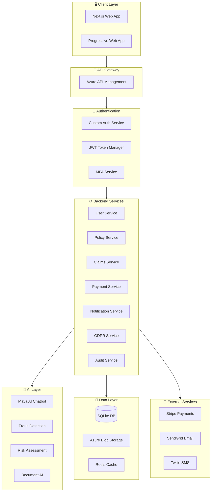
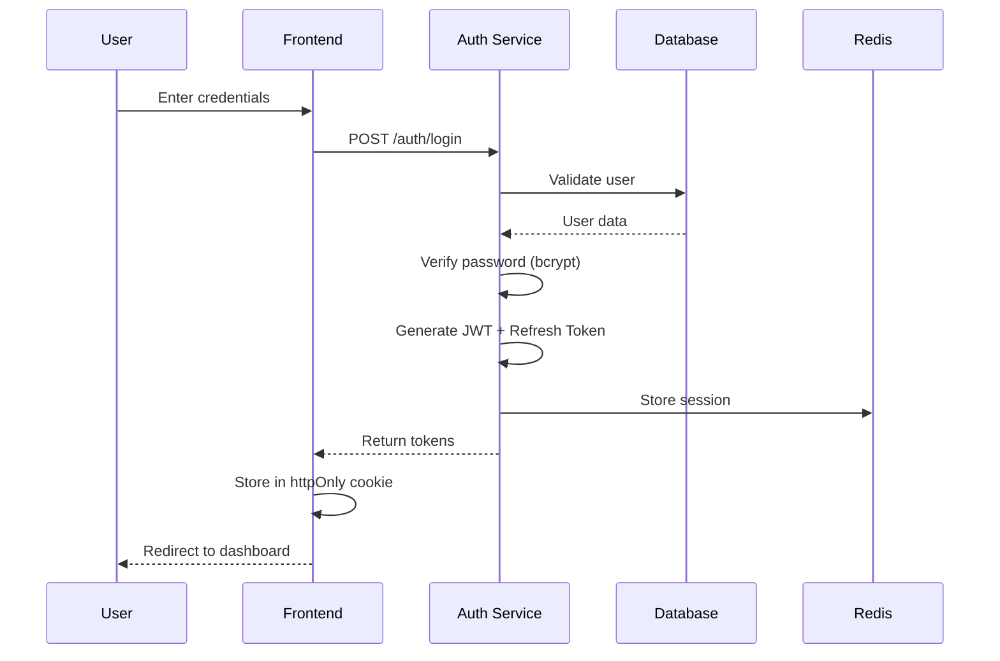
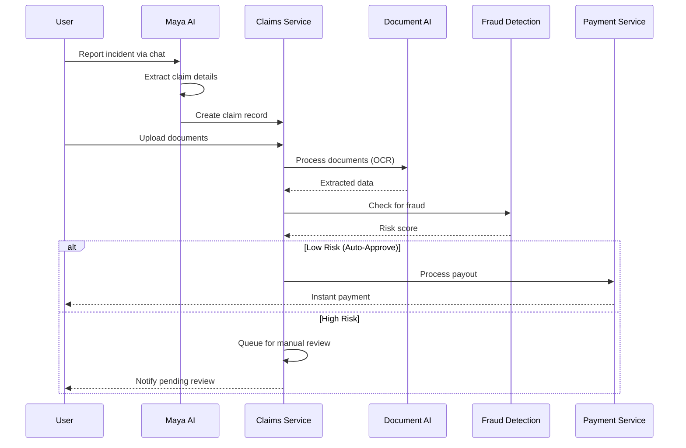
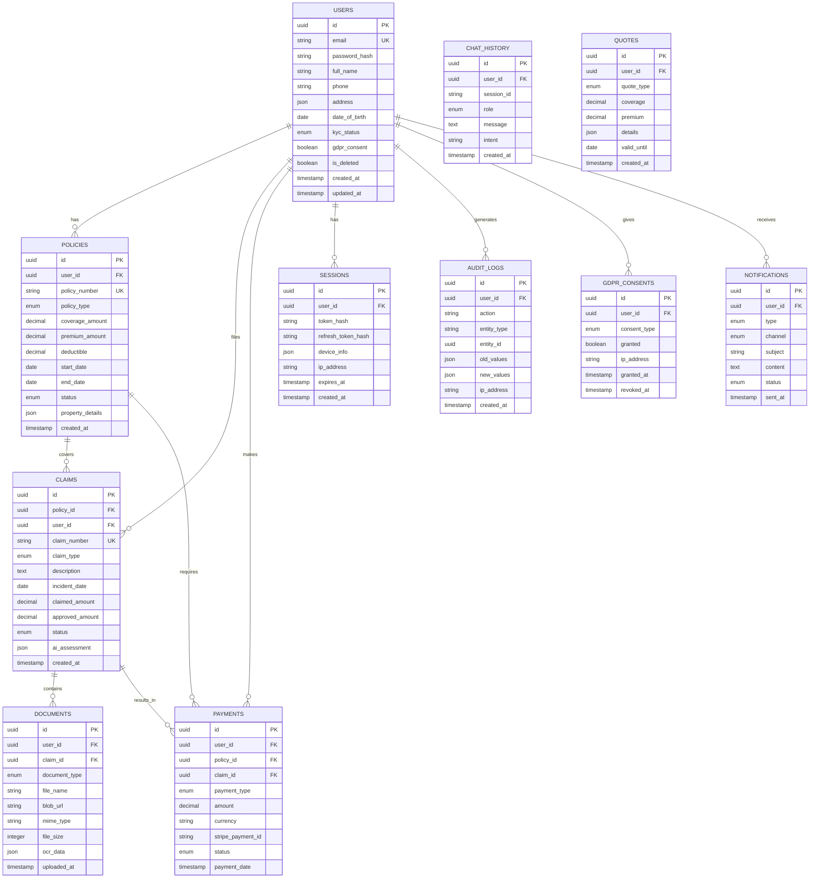
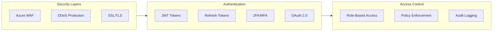
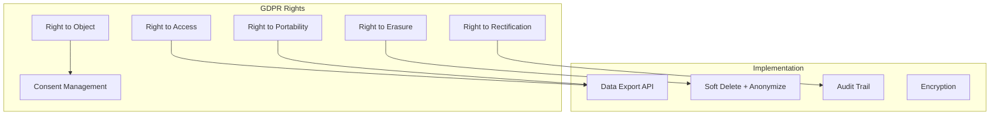
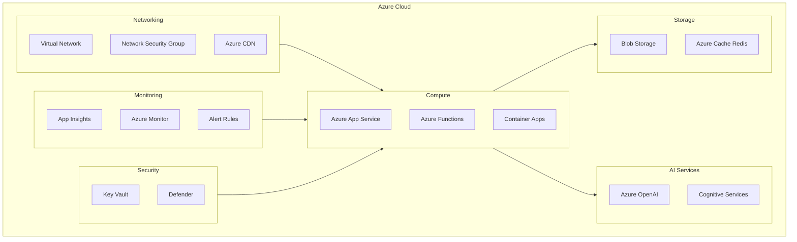
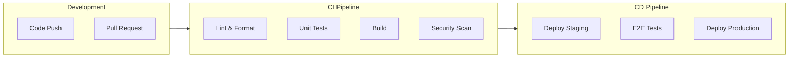

# LemonClaim - Insurance Application Architecture

## 📋 Executive Summary

**LemonClaim** is a modern, full-featured insurance claim application inspired by Lemonade, built with:
- **Frontend**: Next.js 14 (App Router) + Tailwind CSS + TypeScript
- **Backend**: Python FastAPI + SQLAlchemy
- **Database**: SQLite (with option to scale to PostgreSQL)
- **Cloud**: Microsoft Azure
- **AI**: Azure OpenAI for chatbot & ML models for fraud detection

---

## 🏗️ High-Level Architecture



---

## 🔄 System Flow Diagrams

### Authentication Flow



### Claims Processing Flow



---

## 📁 Project Structure

```
lemonclaim/
├── frontend/                    # Next.js 14 Application
│   ├── src/
│   │   ├── app/                 # App Router
│   │   │   ├── (auth)/          # Auth pages (login, register)
│   │   │   ├── (dashboard)/     # Protected dashboard
│   │   │   ├── api/             # API routes (BFF)
│   │   │   ├── claims/          # Claims pages
│   │   │   ├── policies/        # Policy pages
│   │   │   └── chat/            # AI Chat interface
│   │   ├── components/
│   │   │   ├── ui/              # Shadcn/UI components
│   │   │   ├── forms/           # Form components
│   │   │   ├── layout/          # Layout components
│   │   │   └── charts/          # Chart components
│   │   ├── lib/                 # Utilities
│   │   ├── hooks/               # Custom hooks
│   │   ├── stores/              # Zustand stores
│   │   └── types/               # TypeScript types
│   ├── public/                  # Static assets
│   ├── package.json
│   ├── tailwind.config.js
│   └── next.config.js
│
├── backend/                     # Python FastAPI
│   ├── app/
│   │   ├── api/
│   │   │   └── v1/
│   │   │       ├── auth.py
│   │   │       ├── users.py
│   │   │       ├── policies.py
│   │   │       ├── claims.py
│   │   │       ├── payments.py
│   │   │       ├── chat.py
│   │   │       └── admin.py
│   │   ├── core/
│   │   │   ├── config.py
│   │   │   ├── security.py
│   │   │   └── database.py
│   │   ├── models/              # SQLAlchemy models
│   │   ├── schemas/             # Pydantic schemas
│   │   ├── services/            # Business logic
│   │   ├── repositories/        # Data access
│   │   └── middleware/
│   ├── ai/
│   │   ├── chatbot/             # Maya AI
│   │   ├── models/              # ML models
│   │   └── document_ai/         # OCR & verification
│   ├── database/
│   │   └── migrations/          # Alembic
│   ├── tests/
│   ├── main.py
│   └── requirements.txt
│
├── infrastructure/
│   ├── terraform/               # Azure IaC
│   ├── docker/
│   └── k8s/
│
├── docs/
└── .github/workflows/           # CI/CD
```

---

## 💾 Database Schema



---

## 🔐 Security Architecture

### Authentication & Authorization



### Security Measures

| Layer | Technology | Purpose |
|-------|------------|---------|
| Network | Azure WAF | Web Application Firewall |
| Transport | TLS 1.3 | Encrypted communication |
| Authentication | JWT + Refresh | Stateless auth |
| Authorization | RBAC | Role-based permissions |
| Data at Rest | AES-256 | Database encryption |
| Secrets | Azure Key Vault | Secrets management |
| Audit | Comprehensive logging | Compliance tracking |

---

## 🔒 GDPR Compliance

### Data Subject Rights Implementation



### GDPR Features

1. **Consent Management**: Granular consent tracking with timestamps
2. **Data Export**: JSON export of all user data
3. **Right to Delete**: Soft delete with anonymization
4. **Audit Trail**: Complete activity logging
5. **Data Minimization**: Only collect necessary data
6. **Encryption**: AES-256 at rest, TLS in transit
7. **Breach Notification**: Automated alerting system

---

## ☁️ Azure Infrastructure



### Azure Services Used

| Service | Purpose | Tier |
|---------|---------|------|
| App Service | Host Next.js & FastAPI | B2 (Production) |
| Azure CDN | Static asset delivery | Standard |
| Blob Storage | Document storage | Hot tier |
| Redis Cache | Session & API caching | Basic C0 |
| Azure OpenAI | Maya AI Chatbot | Pay-as-you-go |
| Key Vault | Secrets management | Standard |
| Application Insights | Monitoring & APM | Basic |
| API Management | API Gateway | Developer |

---

## 🔌 API Design

### RESTful Endpoints

```
Base URL: /api/v1

Authentication:
  POST   /auth/register          # User registration
  POST   /auth/login             # Login (returns JWT)
  POST   /auth/refresh           # Refresh token
  POST   /auth/logout            # Logout (invalidate session)
  POST   /auth/forgot-password   # Password reset request
  POST   /auth/reset-password    # Reset password
  POST   /auth/verify-mfa        # MFA verification

Users:
  GET    /users/me               # Get current user
  PUT    /users/me               # Update profile
  DELETE /users/me               # Delete account (GDPR)
  GET    /users/me/export        # Export data (GDPR)
  POST   /users/me/consent       # Update GDPR consent

Policies:
  GET    /policies               # List user policies
  POST   /policies               # Create new policy
  GET    /policies/:id           # Get policy details
  PUT    /policies/:id           # Update policy
  DELETE /policies/:id           # Cancel policy
  POST   /policies/quote         # Get instant quote

Claims:
  GET    /claims                 # List user claims
  POST   /claims                 # File new claim
  GET    /claims/:id             # Get claim details
  PUT    /claims/:id             # Update claim
  POST   /claims/:id/documents   # Upload documents
  GET    /claims/:id/status      # Get claim status

Payments:
  GET    /payments               # Payment history
  POST   /payments/premium       # Pay premium
  POST   /payments/setup-intent  # Stripe setup
  GET    /payments/invoices      # Get invoices

Chat:
  POST   /chat/message           # Send message to Maya AI
  GET    /chat/history           # Get chat history
  POST   /chat/feedback          # Rate AI response

Admin:
  GET    /admin/users            # List all users
  GET    /admin/claims           # List all claims
  PUT    /admin/claims/:id       # Review claim
  GET    /admin/analytics        # Dashboard data
```

### API Response Format

```json
{
  "success": true,
  "data": { ... },
  "meta": {
    "page": 1,
    "per_page": 20,
    "total": 100
  },
  "errors": null
}
```

---

## 🚀 Deployment Pipeline



---

## 📊 Tech Stack Summary

| Component | Technology | Version |
|-----------|------------|---------|
| **Frontend Framework** | Next.js | 14.x |
| **UI Library** | Tailwind CSS | 3.x |
| **State Management** | Zustand | 4.x |
| **API Client** | TanStack Query | 5.x |
| **Backend Framework** | FastAPI | 0.109+ |
| **ORM** | SQLAlchemy | 2.x |
| **Database** | SQLite | 3.x |
| **Cache** | Redis | 7.x |
| **AI/ML** | Azure OpenAI | GPT-4 |
| **Payments** | Stripe | Latest |
| **Email** | SendGrid | Latest |
| **SMS** | Twilio | Latest |
| **Cloud** | Microsoft Azure | - |
| **Containers** | Docker | 24.x |
| **CI/CD** | GitHub Actions | - |

---

## 🎯 Feature Roadmap

### Phase 1: MVP (Weeks 1-6)
- [x] User authentication (register, login, MFA)
- [x] Basic dashboard
- [x] Policy browsing and quotes
- [x] Simple claims filing
- [x] GDPR consent management

### Phase 2: Core Features (Weeks 7-12)
- [ ] Full policy management
- [ ] Claims processing workflow
- [ ] Document upload & storage
- [ ] Payment integration (Stripe)
- [ ] Email notifications

### Phase 3: AI Integration (Weeks 13-18)
- [ ] Maya AI chatbot
- [ ] Fraud detection ML model
- [ ] Risk assessment
- [ ] Document OCR
- [ ] Instant claim approval

### Phase 4: Polish & Scale (Weeks 19-24)
- [ ] Advanced analytics dashboard
- [ ] Mobile app (PWA)
- [ ] Performance optimization
- [ ] Security audit
- [ ] Production deployment

---

## 📞 Support

For questions about the architecture, contact the development team or raise an issue in the repository.
